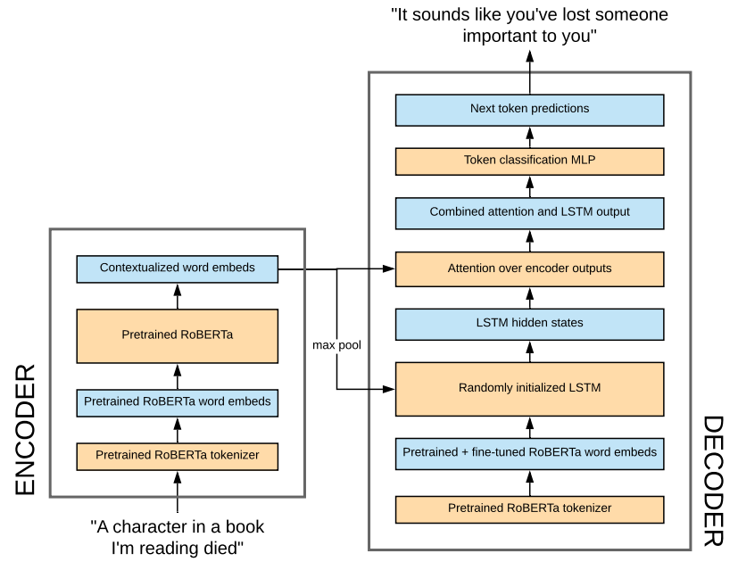

# Youper Challenge - NLP Engineer

## Overview
The system is a generative model, consisting of an encoder-decoder seq2seq stack. The encoder is a pretained roBERTa transformer (12-layer, 768-hidden, 12-heads, 125M parameters), and the decoder is a randomly initialized LSTM (1-layer, 512-hidden, 2.6M parameters, 1-direction). The encoder and decoder are connected in two ways:
1. The decoder LSTM hidden state is initialized with the result of a max pooling operation across the encoder outputs.
1. When making next-token predictions at each timestep, the decoder performs a multiplicative attention operation across the encoder outputs.

The same pretrained tokenizer is used for the encoder and decoder stacks. The encoder uses a frozen set of pretrained word embeddings. The decoder uses a cloned copy of these word embeddings, which are fine-tuned during training.

## Project Structure and Source Code

The source code is located in the file [`youper.py`](youper.py). The following notebooks import this code and step through the development and demonstrate some of the generation capabilities:
1. [**`1.0-eda-feature-engr.ipynb`**](1.0-eda-feature-engr.ipynb): Loads, preps, cleans, and explores the data. Extracts reflections from the answer text.
2. [**`2.0-model-training.ipynb`**](2.0-model-training.ipynb): Trains the system described.
3. [**`3.0-model-inference.ipynb`**](3.0-model-inference.ipynb): Generates reflections for every example in the dataset using the trained model. Prints several examples for manual observation.  

The Python programming language and PyTorch deep learning framework were used. The python environment used to perform this work is represented in the included `requirements.txt` file. 

## Data
As suggested in the challenge, reflections are mined from the therapist answers in the following ways:
1. The first sentence in the answer.
1. Sentences that have the language "seems like" or "sounds like" near the beginning of the sentence.
These mined reflections are used for supervised learning.

## Training
During training, the question text is passed through the encoder, and the decoder is trained to generate the associated reflections in a supervised manner.
The system is trained using the Adam optimizer, a learning rate of 3e-4, and 100% teacher forcing. The entire encoder is frozen during training, whereas the decoder is not frozen. Training is stopped automatically when the validation loss stops improving. The Pytorch Lightning framework is used to facilitate the training process. Training take approximately 15-20 minutes on a single Nvidia GeForce GTX 1080 Ti GPU. 

## Generation
At inference time, the question text is passed through the encoder and a simple greedy decoding scheme is used to generate reflections.

## Transfer Learning
Recent advances in NLP research have introduced the transformer architecture, which is commonly pretrained as a language model on a massive corpus. These pretrained models have shown great power in their world knowledge and text generation capabilities, among many others. Leveraging these pretrained models is an effective technique for building custom systems trained on smaller amounts of domain-specific data.
There are several transfer learning components present in the system:
1. Pretrained roBERTa transformer used as the encoder
1. Pretrained roBERTa subword tokenizer
1. Pretrained roBERTa token embeddings

## Evaluation
Perplexity on the validation set is used to evaluate model performance. A BLEU score might also be appropriate, but would require further research to conclude. It would also be informative to run a sentence parser over the outputs to compute the rate at which the model generates syntactically correct sentences.

Anecdotally, it seems the model is able to generate reasonably coherent reflections, suggests that it is training correctly and there are no major bugs present. The syntactic structure of the generations tends to read pretty smoothly, although there are still plenty of mistakes. This model is an acceptable first attempt but needs significant tuning before going into production.

By manually inspecting a few examples, one can observe that the model is slightly overfit to the training set. The reflections generated on the training set have more diversity and contextual relevance. The validation reflections still have some reasonable quality, but they are  less interesting, and tend to be more generic and repetitive. Please see a few samples from the training and validation sets below. Also see [3.0-model-inference.ipynb](3.0-model-inference.ipynb) for more examples.

From the training set. In this case the model generates a relevant fairly coherent response. 
> QUESTION:
Sometimes I can't stop thinking about life after death. I was raised in a religion that teaches that we will live on forever either in hell or in heaven.  When I think of living forever (even if it is in heaven which should be good), I feel overwhelmed. I don't like the thought of living forever and ever and ever. Sometimes I just can't get the thought out of my mind and the thoughts lead to panic and anxiety.  Am I crazy? I don't think these thoughts are normal.  
ACTUAL REFLECTION:
Many people generate intense anxiety with obsessive thinking.  
GENERATED REFLECTION:
 It sounds like you are experiencing a lot of anxiety and anxiety.

Another from the training set. Here, the model uses the word "torn" (which the therapist uses) but uses it on a different subject than the therapist (therapist is saying the girlfriend is torn, model is saying the user is torn). This could indicate some overfitting. (This example also illustrates a sentence splitting error)
> QUESTION:
She's busy because her mom makes her clean all the time and go out places with her family. We don't talk much because of it. Also, we have little fights. We want to work it out but we don't know how.  
ACTUAL REFLECTION:
Maybe your girlfriend feels torn in her emotions between loyalty toward her family and toward investing herself in a relationship.There are so many "maybes", that the best way to strengthen your relationship is to ask your girlfriend if she feels any  
GENERATED REFLECTION:
 I'm sorry to hear that you are feeling torn and the relationship you are feeling.

From the validation set. The model comes up with a pretty coherent response, but it doesn't seem to be very relevant because the user doesn't mention anything about being depressed.
> QUESTION:
I’m a teenager. My entire family needs family therapy, and more than likely individual therapy. My parents refuse to take action, and I'm tired of it. Is there any way I can get out of this myself?   
ACTUAL REFLECTION:
This sounds like a really tough situation.   
GENERATED REFLECTION:
 I'm sorry to hear that you are feeling pretty depressed.

Another from the validation set. The model correctly identifies "relationship" as being relevant even though the word "relationship" isn't present in either the question or the actual reflection. However, the sentence is nonsensical.

> QUESTION:
I’m trying to make marriage work after a split. Before our split, he lied a lot and broke every promise to me. I don't think he cheated. Last month, I asked what women work with him, so he told me. Yesterday, I found out about a girl that he said he forgot about. Should I be upset?  
ACTUAL REFLECTION:
Are you upset, is the more pertinent question.Everyone has their own tolerance for lies and their unique reasons for being married.  
GENERATED REFLECTION:
 I'm sorry to hear about your relationship about your relationship with your relationship with you.

## Future work

There are several alternative systems which would likely outperform the one developed in this exercise. These more powerful approaches were not pursued due to time constraints imposed by the challenge. In a real-world scenario I would recommend pursuing and experimenting with the following approach: a seq2seq architecture consisting of large transformers (eg, roBERTa, T5, etc) for both the encoder and decoder, each initialized from LM pretraining.

Possible improvements on the existing system:
1. Collect more data. More web scraping, crowd-sourcing, etc.
1. Utilize weak supervision and active learning techniques to collect more labeled examples
1. Explore various ways to improve reflection mining in order to improve label quality
1. Gradually unfreeze the top layers of the encoder during training.
1. Replace existing attention mechanism with multi-headed attention
1. Experiment with varying degrees of teach forcing
1. Experiment with a sampling-based generation scheme with varying degrees of sampling temperature
1. Experiment with more sophisticated algorithms for generation, such as beam search
1. Adding additional layers to the LSTM
1. Increasing the size of the LSTM
1. There are some inefficiencies in the existing attention mechanism that could be resolved to reduce computation/memory complexity
1. As a post-processing step, run a sentence parser over the output to detect poor quality generations before displaying to user 
1. Improve the sentence splitter
